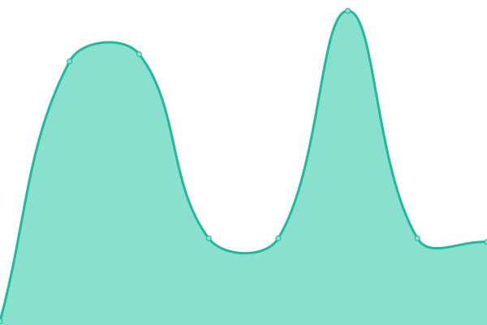

# [📈 Live Status](https://ismyserverworki.ng): <!--live status--> **🟩 All systems operational**

This repository contains the open-source uptime monitor and status page for [Upptime](https://upptime.js.org), powered by [Upptime](https://github.com/upptime/upptime).

With [Upptime](https://upptime.js.org), you can get your own unlimited and free uptime monitor and status page, powered entirely by a GitHub repository. We use [Issues](https://github.com/upptime/upptime/issues) as incident reports, [Actions](https://github.com/Androz2091/status/actions) as uptime monitors, and [Pages](https://ismyserverworki.ng) for the status page.

<!--start: status pages-->
<!-- This summary is generated by Upptime (https://github.com/upptime/upptime) -->
<!-- Do not edit this manually, your changes will be overwritten -->
<!-- prettier-ignore -->
| URL | Status | History | Response Time | Uptime |
| --- | ------ | ------- | ------------- | ------ |
|  [Blog](https://blog.androz2091.fr) | 🟩 Up | [blog.yml](https://github.com/Androz2091/status/commits/HEAD/history/blog.yml) | 

 256ms
     
 | 

<a href="https://ismyserverworki.ng/history/blog">100.00%</a>
    

|  [NextCloud](https://next.androz2091.fr) | 🟩 Up | [next-cloud.yml](https://github.com/Androz2091/status/commits/HEAD/history/next-cloud.yml) | 

 521ms
     
 | 

<a href="https://ismyserverworki.ng/history/next-cloud">100.00%</a>
    

|  [DDPE](https://ddpe.androz2091.fr) | 🟩 Up | [ddpe.yml](https://github.com/Androz2091/status/commits/HEAD/history/ddpe.yml) | 

 209ms
     
 | 

<a href="https://ismyserverworki.ng/history/ddpe">100.00%</a>
    

|  [Diswho](https://diswho.androz2091.fr) | 🟩 Up | [diswho.yml](https://github.com/Androz2091/status/commits/HEAD/history/diswho.yml) | 

 282ms
     
 | 

<a href="https://ismyserverworki.ng/history/diswho">100.00%</a>
    

|  [Umami Analytics](https://analytics.androz2091.fr) | 🟩 Up | [umami-analytics.yml](https://github.com/Androz2091/status/commits/HEAD/history/umami-analytics.yml) | 

 207ms
     
 | 

<a href="https://ismyserverworki.ng/history/umami-analytics">100.00%</a>
    

|  [Plex](https://plex.androz2091.fr/web/index.html) | 🟩 Up | [plex.yml](https://github.com/Androz2091/status/commits/HEAD/history/plex.yml) | 

 269ms
     
 | 

<a href="https://ismyserverworki.ng/history/plex">100.00%</a>
    

|  [Tautulli](https://tautulli.androz2091.fr/auth/login) | 🟩 Up | [tautulli.yml](https://github.com/Androz2091/status/commits/HEAD/history/tautulli.yml) | 

 250ms
     
 | 

<a href="https://ismyserverworki.ng/history/tautulli">100.00%</a>
    

|  [Sabnzbd](https://sabnzbd.androz2091.fr) | 🟩 Up | [sabnzbd.yml](https://github.com/Androz2091/status/commits/HEAD/history/sabnzbd.yml) | 

 303ms
     
 | 

<a href="https://ismyserverworki.ng/history/sabnzbd">100.00%</a>
    

|  [Overseerr](https://overseerr.androz2091.fr) | 🟩 Up | [overseerr.yml](https://github.com/Androz2091/status/commits/HEAD/history/overseerr.yml) | 

 378ms
     
 | 

<a href="https://ismyserverworki.ng/history/overseerr">100.00%</a>
    

|  [Sonarr](https://sonarr.androz2091.fr) | 🟩 Up | [sonarr.yml](https://github.com/Androz2091/status/commits/HEAD/history/sonarr.yml) | 

 272ms
     
 | 

<a href="https://ismyserverworki.ng/history/sonarr">100.00%</a>
    

|  [Radarr](https://radarr.androz2091.fr) | 🟩 Up | [radarr.yml](https://github.com/Androz2091/status/commits/HEAD/history/radarr.yml) | 

 290ms
     
 | 

<a href="https://ismyserverworki.ng/history/radarr">100.00%</a>
    

|  [Bazarr](https://bazarr.androz2091.fr) | 🟩 Up | [bazarr.yml](https://github.com/Androz2091/status/commits/HEAD/history/bazarr.yml) | 

 209ms
     
 | 

<a href="https://ismyserverworki.ng/history/bazarr">100.00%</a>
    

|  [Jackett](https://bazarr.androz2091.fr) | 🟩 Up | [jackett.yml](https://github.com/Androz2091/status/commits/HEAD/history/jackett.yml) | 

 62ms
     
 | 

<a href="https://ismyserverworki.ng/history/jackett">100.00%</a>
    

|  [Portainer](https://portainer.androz2091.fr) | 🟩 Up | [portainer.yml](https://github.com/Androz2091/status/commits/HEAD/history/portainer.yml) | 

 214ms
     
 | 

<a href="https://ismyserverworki.ng/history/portainer">100.00%</a>
    

|  [FileBrowser](https://cloud.androz2091.fr) | 🟩 Up | [file-browser.yml](https://github.com/Androz2091/status/commits/HEAD/history/file-browser.yml) | 

 171ms
     
 | 

<a href="https://ismyserverworki.ng/history/file-browser">100.00%</a>
    

|  [Immich](https://photos.androz2091.fr) | 🟩 Up | [immich.yml](https://github.com/Androz2091/status/commits/HEAD/history/immich.yml) | 

 232ms
     
 | 

<a href="https://ismyserverworki.ng/history/immich">100.00%</a>
    

|  [HasteServer](https://haste.androz2091.fr) | 🟩 Up | [haste-server.yml](https://github.com/Androz2091/status/commits/HEAD/history/haste-server.yml) | 

 191ms
     
 | 

<a href="https://ismyserverworki.ng/history/haste-server">100.00%</a>
    

|  [VaultWarden](https://vault.androz2091.fr) | 🟩 Up | [vault-warden.yml](https://github.com/Androz2091/status/commits/HEAD/history/vault-warden.yml) | 

 188ms
     
 | 

<a href="https://ismyserverworki.ng/history/vault-warden">100.00%</a>
    

|  [QBittorrent](https://qbt.androz2091.fr) | 🟩 Up | [q-bittorrent.yml](https://github.com/Androz2091/status/commits/HEAD/history/q-bittorrent.yml) | 

 212ms
     
 | 

<a href="https://ismyserverworki.ng/history/q-bittorrent">100.00%</a>
    

|  [Instaddict](https://instaddict.androz2091.fr) | 🟩 Up | [instaddict.yml](https://github.com/Androz2091/status/commits/HEAD/history/instaddict.yml) | 

 173ms
     
 | 

<a href="https://ismyserverworki.ng/history/instaddict">100.00%</a>
    

|  [Online Love Calc](https://love-calc.androz2091.fr) | 🟩 Up | [online-love-calc.yml](https://github.com/Androz2091/status/commits/HEAD/history/online-love-calc.yml) | 

 101ms
     
 | 

<a href="https://ismyserverworki.ng/history/online-love-calc">100.00%</a>
    

|  [Slash Commands GUI](https://slash-commands-gui.androz2091.fr) | 🟩 Up | [slash-commands-gui.yml](https://github.com/Androz2091/status/commits/HEAD/history/slash-commands-gui.yml) | 

 169ms
     
 | 

<a href="https://ismyserverworki.ng/history/slash-commands-gui">100.00%</a>
    

|  [Twittycord](https://twittycord.com) | 🟩 Up | [twittycord.yml](https://github.com/Androz2091/status/commits/HEAD/history/twittycord.yml) | 

 530ms
     
 | 

<a href="https://ismyserverworki.ng/history/twittycord">100.00%</a>
    

|  [ManageInvite](https://manage-invite.xyz) | 🟩 Up | [manage-invite.yml](https://github.com/Androz2091/status/commits/HEAD/history/manage-invite.yml) | 

 142ms
     
 | 

<a href="https://ismyserverworki.ng/history/manage-invite">100.00%</a>
    

|  [ManageInvite API](https://api.manage-invite.xyz) | 🟩 Up | [manage-invite-api.yml](https://github.com/Androz2091/status/commits/HEAD/history/manage-invite-api.yml) | 

 200ms
     
 | 

<a href="https://ismyserverworki.ng/history/manage-invite-api">100.00%</a>
    

|  [(stale) ManageInvite API](https://dash.manage-invite.xyz) | 🟩 Up | [stale-manage-invite-api.yml](https://github.com/Androz2091/status/commits/HEAD/history/stale-manage-invite-api.yml) | 

 297ms
     
 | 

<a href="https://ismyserverworki.ng/history/stale-manage-invite-api">100.00%</a>
    

|  [Tagger](https://timetagger.androz2091.fr) | 🟩 Up | [tagger.yml](https://github.com/Androz2091/status/commits/HEAD/history/tagger.yml) | 

 249ms
     
 | 

<a href="https://ismyserverworki.ng/history/tagger">100.00%</a>
    

|  [Mealie](https://recipes.androz2091.fr) | 🟩 Up | [mealie.yml](https://github.com/Androz2091/status/commits/HEAD/history/mealie.yml) | 

 196ms
     
 | 

<a href="https://ismyserverworki.ng/history/mealie">100.00%</a>
    

|  [SSHception](ssh.androz2091.fr) | 🟩 Up | [ss-hception.yml](https://github.com/Androz2091/status/commits/HEAD/history/ss-hception.yml) | 

 48ms
     
 | 

<a href="https://ismyserverworki.ng/history/ss-hception">100.00%</a>
    

<!--end: status pages-->

[**Visit our status website →**](https://ismyserverworki.ng)

## 📄 License

- Powered by: [Upptime](https://github.com/upptime/upptime)
- Code: [MIT](./LICENSE) © [Upptime](https://upptime.js.org)
- Data in the `./history` directory: [Open Database License](https://opendatacommons.org/licenses/odbl/1-0/)
