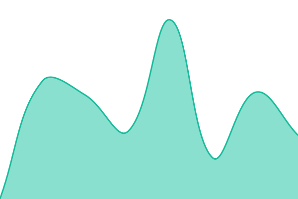
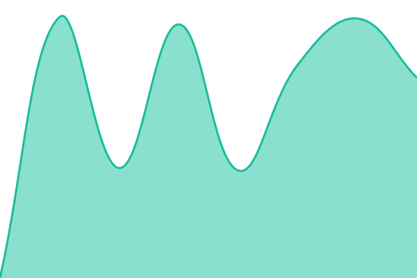
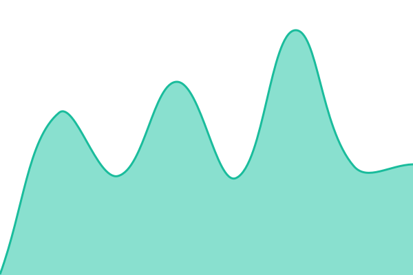
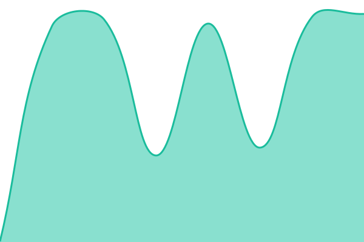
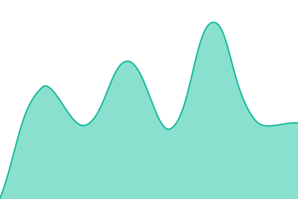

# [📈 Live Status](https://ismyserverworki.ng): <!--live status--> **🟩 All systems operational**

This repository contains the open-source uptime monitor and status page for [Upptime](https://upptime.js.org), powered by [Upptime](https://github.com/upptime/upptime).

With [Upptime](https://upptime.js.org), you can get your own unlimited and free uptime monitor and status page, powered entirely by a GitHub repository. We use [Issues](https://github.com/upptime/upptime/issues) as incident reports, [Actions](https://github.com/Androz2091/status/actions) as uptime monitors, and [Pages](https://ismyserverworki.ng) for the status page.

<!--start: status pages-->
<!-- This summary is generated by Upptime (https://github.com/upptime/upptime) -->
<!-- Do not edit this manually, your changes will be overwritten -->
<!-- prettier-ignore -->
| URL | Status | History | Response Time | Uptime |
| --- | ------ | ------- | ------------- | ------ |
|  [Blog](https://blog.androz2091.fr) | 🟩 Up | [blog.yml](https://github.com/Androz2091/status/commits/HEAD/history/blog.yml) | 

 464ms
     
 | 

<a href="https://ismyserverworki.ng/history/blog">100.00%</a>
    

|  [DDPE](https://ddpe.androz2091.fr) | 🟩 Up | [ddpe.yml](https://github.com/Androz2091/status/commits/HEAD/history/ddpe.yml) | 

 400ms
     
 | 

<a href="https://ismyserverworki.ng/history/ddpe">100.00%</a>
    

|  [Diswho](https://diswho.androz2091.fr) | 🟩 Up | [diswho.yml](https://github.com/Androz2091/status/commits/HEAD/history/diswho.yml) | 

 404ms
     
 | 

<a href="https://ismyserverworki.ng/history/diswho">100.00%</a>
    

|  [Umami Analytics](https://analytics.androz2091.fr) | 🟩 Up | [umami-analytics.yml](https://github.com/Androz2091/status/commits/HEAD/history/umami-analytics.yml) | 

 898ms
     
 | 

<a href="https://ismyserverworki.ng/history/umami-analytics">100.00%</a>
    

|  [Plex](https://plex.androz2091.fr/web/index.html) | 🟩 Up | [plex.yml](https://github.com/Androz2091/status/commits/HEAD/history/plex.yml) | 

 545ms
     
 | 

<a href="https://ismyserverworki.ng/history/plex">100.00%</a>
    

|  [Overseerr](https://overseerr.androz2091.fr) | 🟩 Up | [overseerr.yml](https://github.com/Androz2091/status/commits/HEAD/history/overseerr.yml) | 

 1256ms
     
 | 

<a href="https://ismyserverworki.ng/history/overseerr">100.00%</a>
    

|  [FileBrowser](https://cloud.androz2091.fr) | 🟩 Up | [file-browser.yml](https://github.com/Androz2091/status/commits/HEAD/history/file-browser.yml) | 

 423ms
     
 | 

<a href="https://ismyserverworki.ng/history/file-browser">100.00%</a>
    

|  [Immich](https://photos.androz2091.fr) | 🟩 Up | [immich.yml](https://github.com/Androz2091/status/commits/HEAD/history/immich.yml) | 

 430ms
     
 | 

<a href="https://ismyserverworki.ng/history/immich">87.28%</a>
    

|  [HasteServer](https://haste.androz2091.fr) | 🟩 Up | [haste-server.yml](https://github.com/Androz2091/status/commits/HEAD/history/haste-server.yml) | 

 365ms
     
 | 

<a href="https://ismyserverworki.ng/history/haste-server">100.00%</a>
    

|  [VaultWarden](https://vault.androz2091.fr) | 🟩 Up | [vault-warden.yml](https://github.com/Androz2091/status/commits/HEAD/history/vault-warden.yml) | 

 468ms
     
 | 

<a href="https://ismyserverworki.ng/history/vault-warden">100.00%</a>
    

|  [QBittorrent](https://qbt.androz2091.fr) | 🟩 Up | [q-bittorrent.yml](https://github.com/Androz2091/status/commits/HEAD/history/q-bittorrent.yml) | 

 377ms
     
 | 

<a href="https://ismyserverworki.ng/history/q-bittorrent">100.00%</a>
    

|  [Instaddict](https://instaddict.androz2091.fr) | 🟩 Up | [instaddict.yml](https://github.com/Androz2091/status/commits/HEAD/history/instaddict.yml) | 

 867ms
     
 | 

<a href="https://ismyserverworki.ng/history/instaddict">100.00%</a>
    

|  [Online Love Calc](https://love-calc.androz2091.fr) | 🟩 Up | [online-love-calc.yml](https://github.com/Androz2091/status/commits/HEAD/history/online-love-calc.yml) | 

 428ms
     
 | 

<a href="https://ismyserverworki.ng/history/online-love-calc">100.00%</a>
    

|  [Slash Commands GUI](https://slash-commands-gui.androz2091.fr) | 🟩 Up | [slash-commands-gui.yml](https://github.com/Androz2091/status/commits/HEAD/history/slash-commands-gui.yml) | 

 353ms
     
 | 

<a href="https://ismyserverworki.ng/history/slash-commands-gui">100.00%</a>
    

|  [ManageInvite](https://manage-invite.xyz) | 🟩 Up | [manage-invite.yml](https://github.com/Androz2091/status/commits/HEAD/history/manage-invite.yml) | 

 648ms
     
 | 

<a href="https://ismyserverworki.ng/history/manage-invite">100.00%</a>
    

|  [Tagger](https://timetagger.androz2091.fr) | 🟩 Up | [tagger.yml](https://github.com/Androz2091/status/commits/HEAD/history/tagger.yml) | 

 805ms
     
 | 

<a href="https://ismyserverworki.ng/history/tagger">100.00%</a>
    

|  [Harbor](https://harbor.androz2091.fr) | 🟩 Up | [harbor.yml](https://github.com/Androz2091/status/commits/HEAD/history/harbor.yml) | 

 345ms
     
 | 

<a href="https://ismyserverworki.ng/history/harbor">100.00%</a>
    

|  [Main website (ndd androz2091)](https://androz2091.fr) | 🟩 Up | [main-website-ndd-androz2091.yml](https://github.com/Androz2091/status/commits/HEAD/history/main-website-ndd-androz2091.yml) | 

 431ms
     
 | 

<a href="https://ismyserverworki.ng/history/main-website-ndd-androz2091">100.00%</a>
    

|  [Main website (ndd simonlefort.fr)](https://simonlefort.fr) | 🟩 Up | [main-website-ndd-simonlefort-fr.yml](https://github.com/Androz2091/status/commits/HEAD/history/main-website-ndd-simonlefort-fr.yml) | 

 682ms
     
 | 

<a href="https://ismyserverworki.ng/history/main-website-ndd-simonlefort-fr">100.00%</a>
    

|  [Main website (ndd simonlefort.ch)](https://simonlefort.ch) | 🟩 Up | [main-website-ndd-simonlefort-ch.yml](https://github.com/Androz2091/status/commits/HEAD/history/main-website-ndd-simonlefort-ch.yml) | 

 540ms
     
 | 

<a href="https://ismyserverworki.ng/history/main-website-ndd-simonlefort-ch">100.00%</a>
    

|  [Flep Guessr](https://flepguessr-cs214.androz2091.fr) | 🟩 Up | [flep-guessr.yml](https://github.com/Androz2091/status/commits/HEAD/history/flep-guessr.yml) | 

 389ms
     
 | 

<a href="https://ismyserverworki.ng/history/flep-guessr">100.00%</a>
    

|  [h5ai (Servarr)](https://h5ai-servarr.androz2091.fr) | 🟩 Up | [h5ai-servarr.yml](https://github.com/Androz2091/status/commits/HEAD/history/h5ai-servarr.yml) | 

 456ms
     
 | 

<a href="https://ismyserverworki.ng/history/h5ai-servarr">100.00%</a>
    

|  [Androz2091 Discord Redirection](https://androz2091.fr/discord) | 🟩 Up | [androz2091-discord-redirection.yml](https://github.com/Androz2091/status/commits/HEAD/history/androz2091-discord-redirection.yml) | 

 323ms
     
 | 

<a href="https://ismyserverworki.ng/history/androz2091-discord-redirection">100.00%</a>
    

|  [Dumpus (landing)](https://dumpus.app) | 🟩 Up | [dumpus-landing.yml](https://github.com/Androz2091/status/commits/HEAD/history/dumpus-landing.yml) | 

 372ms
     
 | 

<a href="https://ismyserverworki.ng/history/dumpus-landing">100.00%</a>
    

|  [Dumpus (web client)](https://web.dumpus.app) | 🟩 Up | [dumpus-web-client.yml](https://github.com/Androz2091/status/commits/HEAD/history/dumpus-web-client.yml) | 

 529ms
     
 | 

<a href="https://ismyserverworki.ng/history/dumpus-web-client">100.00%</a>
    

|  [Dumpus (API)](https://api.dumpus.app/health) | 🟩 Up | [dumpus-api.yml](https://github.com/Androz2091/status/commits/HEAD/history/dumpus-api.yml) | 

 2051ms
     
 | 

<a href="https://ismyserverworki.ng/history/dumpus-api">100.00%</a>
    

|  [PDFDing](https://pdfding.androz2091.fr) | 🟩 Up | [pdf-ding.yml](https://github.com/Androz2091/status/commits/HEAD/history/pdf-ding.yml) | 

 1111ms
     
 | 

<a href="https://ismyserverworki.ng/history/pdf-ding">100.00%</a>
    

|  [S4S Programming website](https://prog.students4students.ch) | 🟩 Up | [s4-s-programming-website.yml](https://github.com/Androz2091/status/commits/HEAD/history/s4-s-programming-website.yml) | 

 1785ms
     
 | 

<a href="https://ismyserverworki.ng/history/s4-s-programming-website">100.00%</a>
    

|  [Madeam](https://madeam.fr) | 🟩 Up | [madeam.yml](https://github.com/Androz2091/status/commits/HEAD/history/madeam.yml) | 

 1290ms
     
 | 

<a href="https://ismyserverworki.ng/history/madeam">100.00%</a>
    

|  [Change Detection](https://changedetection.androz2091.fr) | 🟩 Up | [change-detection.yml](https://github.com/Androz2091/status/commits/HEAD/history/change-detection.yml) | 

 344ms
     
 | 

<a href="https://ismyserverworki.ng/history/change-detection">100.00%</a>
    

|  [Monica](https://monica.androz2091.fr) | 🟩 Up | [monica.yml](https://github.com/Androz2091/status/commits/HEAD/history/monica.yml) | 

 701ms
     
 | 

<a href="https://ismyserverworki.ng/history/monica">100.00%</a>
    

|  [Grafana](https://prometheus-grafana.androz2091.fr) | 🟩 Up | [grafana.yml](https://github.com/Androz2091/status/commits/HEAD/history/grafana.yml) | 

 335ms
     
 | 

<a href="https://ismyserverworki.ng/history/grafana">100.00%</a>
    

|  [Radarr](https://radarr.androz2091.fr) | 🟩 Up | [radarr.yml](https://github.com/Androz2091/status/commits/HEAD/history/radarr.yml) | 

 360ms
     
 | 

<a href="https://ismyserverworki.ng/history/radarr">100.00%</a>
    

|  [Sonarr](https://sonarr.androz2091.fr) | 🟩 Up | [sonarr.yml](https://github.com/Androz2091/status/commits/HEAD/history/sonarr.yml) | 

 353ms
     
 | 

<a href="https://ismyserverworki.ng/history/sonarr">100.00%</a>
    

|  [Tautulli](https://tautulli.androz2091.fr) | 🟩 Up | [tautulli.yml](https://github.com/Androz2091/status/commits/HEAD/history/tautulli.yml) | 

 354ms
     
 | 

<a href="https://ismyserverworki.ng/history/tautulli">100.00%</a>
    

|  [Bonds](https://bonds.androz2091.fr) | 🟩 Up | [bonds.yml](https://github.com/Androz2091/status/commits/HEAD/history/bonds.yml) | 

 4817ms
     
 | 

<a href="https://ismyserverworki.ng/history/bonds">100.00%</a>
    

|  [AirTrail](https://airtrail.androz2091.fr) | 🟩 Up | [air-trail.yml](https://github.com/Androz2091/status/commits/HEAD/history/air-trail.yml) | 

 309ms
     
 | 

<a href="https://ismyserverworki.ng/history/air-trail">100.00%</a>
    

|  [SuperWaymo](https://superwaymo.androz2091.fr) | 🟩 Up | [super-waymo.yml](https://github.com/Androz2091/status/commits/HEAD/history/super-waymo.yml) | 

 333ms
     
 | 

<a href="https://ismyserverworki.ng/history/super-waymo">100.00%</a>
    

|  [TinyAuth](https://auth.androz2091.fr) | 🟩 Up | [tiny-auth.yml](https://github.com/Androz2091/status/commits/HEAD/history/tiny-auth.yml) | 

 349ms
     
 | 

<a href="https://ismyserverworki.ng/history/tiny-auth">100.00%</a>
    

|  [Paperless](https://documents.androz2091.fr) | 🟩 Up | [paperless.yml](https://github.com/Androz2091/status/commits/HEAD/history/paperless.yml) | 

 424ms
     
 | 

<a href="https://ismyserverworki.ng/history/paperless">100.00%</a>
    

|  [SABnzbd](https://sabnzbd.androz2091.fr) | 🟩 Up | [sa-bnzbd.yml](https://github.com/Androz2091/status/commits/HEAD/history/sa-bnzbd.yml) | 

 311ms
     
 | 

<a href="https://ismyserverworki.ng/history/sa-bnzbd">100.00%</a>
    

|  [Jellyfin](https://jellyfin.androz2091.fr) | 🟩 Up | [jellyfin.yml](https://github.com/Androz2091/status/commits/HEAD/history/jellyfin.yml) | 

 5816ms
     
 | 

<a href="https://ismyserverworki.ng/history/jellyfin">100.00%</a>
    

|  [Invoice Ninja](https://ninja.androz2091.fr) | 🟩 Up | [invoice-ninja.yml](https://github.com/Androz2091/status/commits/HEAD/history/invoice-ninja.yml) | 

 574ms
     
 | 

<a href="https://ismyserverworki.ng/history/invoice-ninja">58.07%</a>
    

|  [Shlink](https://go.simonlefort.ch/rest/health) | 🟩 Up | [shlink.yml](https://github.com/Androz2091/status/commits/HEAD/history/shlink.yml) | 

 1040ms
     
 | 

<a href="https://ismyserverworki.ng/history/shlink">95.08%</a>
    

<!--end: status pages-->

[**Visit our status website →**](https://ismyserverworki.ng)

## 📄 License

- Powered by: [Upptime](https://github.com/upptime/upptime)
- Code: [MIT](./LICENSE) © [Upptime](https://upptime.js.org)
- Data in the `./history` directory: [Open Database License](https://opendatacommons.org/licenses/odbl/1-0/)
